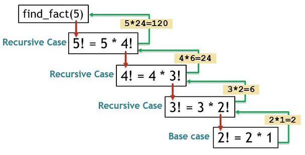

## Recursion

A recursive function aims to solve a problem by breaking it up into smaller and smaller chunks with the same algorithm until it's trivial.

Every recursive function has 2 parts:

1. Terminating / base case - when should the recursion stop?
2. Recursive case - the function calls itself with slightly different arguments to break the problem down

