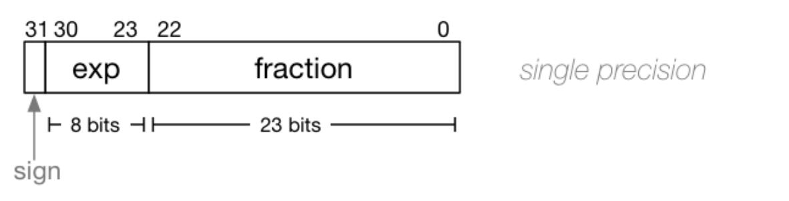

## Floating Point Numbers

Rough representation: (-1)sign x (1 + fraction) x 2exponent \
This idea is similar to scientific notation.

### Scientific Notation Examples

134000 = 1.34 x 105 \
0.000134 = 1.34 x 10-4

### Base 2 Equivalent Example

0b10001 = 17 x 2-5 = 0.53125

### Floating Point Numbers Binary Representation

We mainly look at 32 bit floating point numbers - floats in C.

> sign - first/most significant bit (0th bit)

> exponent - next 8 bits (1st-8th bit) -> ranges from 0 - 255

> fraction - next 23 bits (9-31th bits)

floating point number -  (-1) sign x (1 + fraction x 2 -23) x 2exponent - 127  

### General
- sign bit is 1 - negative number -> (-1)1 = -1
- sign bit is 0 - positive number -> (-1)0 = 1

Example: floating point binary representation is 0b 1 01110000 10000000000000000000000
Decimal = (-1)^1 x (1 + 4194304 x 2^-23) x 2^(112 - 127) = -4.57763671875e-05

### Special Cases

> exact 0 - exponent = 0 and fraction = 0

_ 00000000 00000000000000000000000

(1 + 0 x 2 -23) x 2 0 - 127
= 1 x 2 -127 = 5.877471754111438e-39
  - sign bit = 0, +0
  - sign bit = 1, -0

> infinity - exponent = 255 (max) and fraction = 0

_ 11111111 00000000000000000000000

(1 + 0 x 2 -23) x 2 255 - 127
= 1 x 2 128
  - sign bit = 0, +inf
  - sign bit = 1, -inf

> NaN (not a number) - e.g. 1/0, exponent = 255 (max) and fraction != 0

### Notes

Quick note that can not denote every possible floating point number in binary. There will be precision errors, lecture example looks at 0.1. 