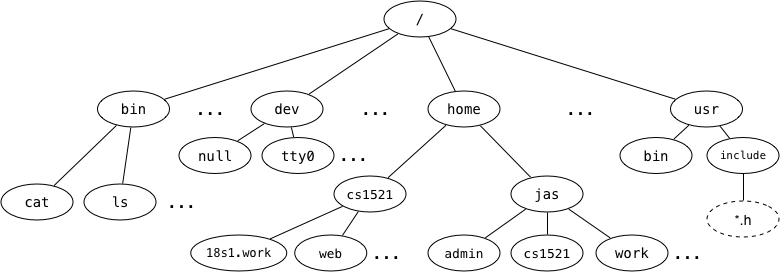

# FILES

## File Systems

Directories/Folders and Files



```
a) full pathname of the web directory -> /home/cs1521/web
b) ~jas/../.. 
~ in unix represents the home directory
~jas - /home/jas
~jas/../.. -> root or /
c) link to parent directory -> ..
d) cat -> file
e) home -> directory
f) tty0 -> character special file, special files allowing the OS to communicate with input/output devices
dev -> devices
extra: /dev/null - a blackhole where you can send garbage output that you don't want to store
```

### Useful Commands
- cd .. moves the directory back by one directory, i.e., go to the parent directory
  - link to parent directory is stored as ..
- cd ~ to get to the root home directory (do `echo $HOME` to show where this is)
  - extra: in bash, there is this thing called tilde expansion if you're interested

### Symbolic Links
A special kind of file that simply contains the name of another file. They allow arbitrary links between filesystem objects.

They can link up to objects higher in the tree structure, creating graphs.


## Files in C
FILE * - file pointer is a typedef'd structure used by the standard io library to hold the appropriate data for use of fopen, and its family of functions.

Main items it contains:
- the file contents
- the position up to in the file

typedef: a keyword used to provide existing data types with a new name
> e.g. \
> typedef struct students { \
> &nbsp; &nbsp; char name[50]; \
> &nbsp; &nbsp; char branch[50]; \
> &nbsp; &nbsp; int ID_no; \
> } stu;

### File functions
Most need "#include <stdio.h>".

- FILE *fopen(path, mode)
  - modes:
    - "r" - read
    - "w" - write / creating a new file and writing to it (if the file already exists, it will be truncated to size 0, i.e., all contents are erased)
    - "a" - append / add chars to the end of the file
    - "r+", "w+", "a+"
  - e.g. fopen("/bin/cat", "r")
  - special error cases
    - NULL is returned and errno is set to indicate the error
    - Reasons:
      - If the file you tried to open for reading does not exist.
      - If you try to open a file you do not have permission to access.
      - If the "mode" string was invalid.
      - If the system is out of memory.
      - If you try to create a file and your quota of disk blocks or inodes has been exhausted.
      - If the pathname was too long.
      - Etc...

FILE *file = fopen("test.txt", "r"); \
if (file == NULL) // if there is an error, do some error handling

- fclose (closes a file)
- fseek (move to a different position in our file)
- fprintf - more general version of printf
- fgetc - get the next character/byte and move our position by one

```
Note: returns an unsigned char cast to an int or EOF (hash-defined as -1)
```

- fgets - gets the next line from a file pointer and moves to the next line
- fputs - writes a line to a file

```
Note: fgets or fputs work with C strings: arrays of bytes, terminated with a zero byte, '\0'.

Binary data may naturally contain zero bytes, and thus cannot be treated as a normal string, therefore functions that work on strings (including fgets or fputs) will not behave correctly.
```

## Streams
- stdin
- stdout
- they are FILE * objects

### Functions
- fprintf -> printf (these are the same, except printf prints to only stdout and fprintf takes in the file/stream you can write to)
