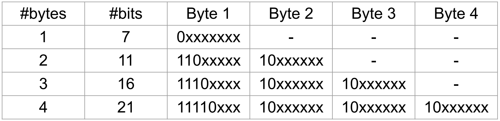

# Summary

- manipulate files with low-level operating system calls
- introduce environment variables and how programs can access and manipulate them
- understand and practice coding with UTF-8 encoded characters

# Tutorial 9 Notes

## File Functions (Continued)

| Function             | Low-Level Operating System (OS) Calls (e.g., `open`, `read`) | C stdio Library (`fopen`, `fread`)            |
|--------------------|--------------------------------------------|-----------------------------------------------|
| Return Type        | File descriptor (`int`)                    | FILE pointer (`FILE*`)                        |
| Buffering          | Unbuffered                                | Buffered (handled by library)                 |
| Portability        | Unix/Linux-specific (POSIX)               | Cross-platform (ANSI C - Linux, Windows, macOS)                       |
| Performance        | Potentially higher in critical cases       | Generally efficient for most use cases        |
| Flexibility        | Fine-grained control over I/O              | Simplified and abstracted interface           |
| Suitability        | Devices, sockets, low-level resources      | Regular file handling                         |
| Thread Safety      | Generally no locking                       | Locking used for shared FILE* streams         |
| Complexity         | More verbose and error-prone               | Easier to write, read, and maintain           |

| Operation            | Low-Level OS Call       | C stdio Library (stdio.h) | Key Differences                                                                 |
|----------------------|--------------------------|----------------------------|----------------------------------------------------------------------------------|
| Open a file          | `open()`                 | `fopen()`                  | `open()` returns a file descriptor (int); `fopen()` returns a FILE* stream.     |
| Read from a file     | `read()`                 | `fread()` / `fgets()`      | `read()` works on raw bytes; `fread()` buffers and handles data as objects.     |
| Write to a file      | `write()`                | `fwrite()` / `fputs()`     | `write()` writes raw bytes; `fwrite()` uses buffering, supports objects.        |
| Seek in file         | `lseek()`                | `fseek()`, `ftell()`       | `lseek()` uses byte offset; `fseek()` works with streams.                        |
| Close a file         | `close()`                | `fclose()`                 | `close()` closes file descriptors; `fclose()` flushes buffers then closes.      |
| Flush output buffer  | N/A                      | `fflush()`                 | `fflush()` ensures buffered output is written; no direct equivalent in syscall. |
| Check EOF            | N/A                      | `feof()`                   | `feof()` checks if end-of-file was reached on a FILE* stream.                   |
| Error handling       | `errno`                  | `ferror()`, `perror()`     | stdio provides higher-level error detection and reporting.                      |

### Low-Level OS Calls Uses
- You need direct control over file descriptors or are working with:
  - Sockets/networks, pipes, character/block devices.
- Performance is critical and you want to manage your own buffering.
- You're building systems-level tools (e.g., shells, daemons).
- You need atomic operations (e.g., `open` with `O_CREAT | O_EXCL`).
- Portability is not a concern (sticking to Unix-like systems).

### C stdio Library Functions Uses:
- You're handling regular file I/O in applications.
- You want platform portability (C standard library).
- You prefer simple and readable code.
- Buffering benefits your workload (e.g., reading files line-by-line).
- You're doing formatted input/output (`fprintf`, `fscanf`).

### Examples

Consider the lseek(fd, offset, whence) function.

- What is its purpose?

- When would it be useful?

- What does its return value represent?

Consider a file of size 10,000 bytes, open for reading on file descriptor fd, initially positioned at the start of the file (offset 0). What will be the file position after each of these calls to lseek()? Assume that they are executed in sequence, and one will change the file state that the next one deals with.

Initial: offset 0
lseek(fd, 0, SEEK_END) -> 10,000 + 0 = 10,000 
lseek(fd, -1000, SEEK_CUR) -> 10,000 - 1,000 = 9,000
lseek(fd, 0, SEEK_SET) -> 0
lseek(fd, -100, SEEK_SET);
lseek(fd, 1000, SEEK_SET);
lseek(fd, 1000, SEEK_CUR);

## Environment Variables
> environment variables are variables defined outside your program, and "in the environment where you run the program", typically defined in your terminal/shell 
> $HOME - environment variable that stores the pathname of the HOME directory that contains the files of the user (defined automatically when the user is created)

> getenv - gets an environment variable and returns NULL if it was not set

## Misc
> sprintf - writes to a string variable \
> snprintf - also has an additional argument to specify the max number of bytes written to the buffer variable

## UTF-8 Encoding

Why did UTF-8 replace the ASCII coding standard? What is the difference in how ASCII and UTF-8 codepoints are represented in bytes?

